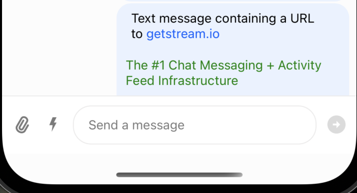

# Updated message while using a custom Card component

## Setup/installation

**NOTE:** I will use `yarn` in the examples here, but this should work fine with `npm` and `pnpm` as well if you prefer those

### 1. Install dependencies

``` shell
yarn install && yarn run pod-install
```

### 2. Add the necessary environment variables:

| variable          | description                                                                                                                                                                         | Where to find it                                                                                                                                                    |
|-------------------|-------------------------------------------------------------------------------------------------------------------------------------------------------------------------------------|---------------------------------------------------------------------------------------------------------------------------------------------------------------------|
| STREAM_API_KEY    | Your API token for [Stream](https://getstream.io)                                                                                                                                   | On you [dashboard](https://getstream.io/dashboard/v2), select your application -> Chat -> Overview -> App Access Keys                                               |
| STREAM_API_SECRET | The API secret for your Stream application                                                                                                                                          | Next to the API key                                                                                                                                                 |
| STREAM_USER_ID    | The ID of the user to connect with for this test                                                                                                                                    | You can use an existing user, or add a new user ID (unique)                                                                                                         |
| STREAM_USER_TOKEN | The [JWT token](https://getstream.io/chat/docs/javascript/tokens_and_authentication/?language=javascript#authentication-vs-authorization) used to authenticate the user with Stream | You can generate a token [with this generator](https://getstream.io/chat/docs/javascript/tokens_and_authentication/?language=javascript#manually-generating-tokens) |

### 3. Start the application

#### iOS

``` shell
yarn ios
```

#### Android

``` shell
yarn android
```

### 4. Send a message with a URL preview in a channel

Any message with a URL should suffice.

For example:

> Test message containing a URL to https://getstream.io

The message should look something like this:



### 5. Find the message ID to update the text content of 

There is a helper script in this repository to find this if you have the ID of the channel you send a message in. If not, you can find the message ID in the Chat Explorer on your [dashboard](https://getstream.io/dashboard/v2/).

To use the helper script: 

1. Open `./scripts/getMessageIdsForChannel.mjs`
2. Add your channel ID to `CHANNEL_ID_TO_GET_MESSAGES_FROM`
3. Save the file
4. In the root of the repository run `yarn get-messages`

The ID, text, and user ID for the last 3 messages should be written to the output of the script. If an error is displayed instead, feel free to open an issue in this repository and we'll figure out what's going on.

The message ID from this step will be needed for step #6.

### 6. Update the message with the script supplied

This will run a partial update of the message, appending a string to the message text automatically, which in turn should update automatically in the application 

**NOTE:** The application should still be running on your emulator or device, with the relevant channel open

1. Open `./scripts/updateMessage.mjs`
2. Add the message ID from step #5 to `MESSAGE_ID_TO_UPDATE`
3. Save the file 
4. In the root of the repository run `yarn update-message`

The message should be updated in the application without having to manually refresh or re-render the message list/Channel component.

### 7. Replace the text in the message including a new URL


This will run a full update of the message, including a new URL to the Card component will visibly change. 

**NOTE:** The application should still be running on your emulator or device, with the relevant channel open

1. Open `./scripts/replaceMessage.mjs`
2. Add the message ID from step #5 to `MESSAGE_ID_TO_UPDATE`
3. Save the file 
4. In the root of the repository run `yarn replace-message`

The message should be updated in the application without having to manually refresh or re-render the message list/Channel component. The URL preview should also be updated to reflect the new URL in the text of the message.

## Demo:

### Appending text to the message 

[View recording on Loom](https://www.loom.com/share/ce3f158a86ec49ee973c40d1db6588f0 "Loom video")

### Replacing the message with a new URL (Update the card specifically)

[View recording on Loom](https://www.loom.com/share/7ec3d16d8e2c45c9998236002998b62d "Loom video")
